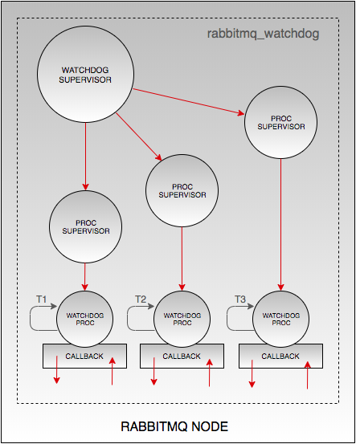

# RabbitMQ Watchdog Plugin

RabbitMQ consists of multiple applications and sub-components which, during the node's uptime may undergo or be subjected to, a number of operations leading to disruptions in the manner in which they operate. For example, performance of the RabbitMQ Management plugin may be affected by a node's high memory utilization, or, shovel/federation links may have been permanently terminated due to terrible network conditions. In such instances, operators may, or may not, have immediate access to the affected installation in order to carry out recovery procedures for the affected sub-components. Hence the need of this plugin, whcih introduces a watchdog layer .

The RabbitMQ Watchdog plugin is a sub-system designed and built to target other internal RabbitMQ sub-components, with the purpose of assisting in checking for operation validity, upon which hypothesis is made on the type of action to take next, as recovery attempt and strategy.

## Design

The RabbitMQ Watchdog's design consists of a top level supervisor, which when started, will in turn start underlying watchdog process supervisors for each configured watchdog. The underlying watchdog process supervisors will initiate the actual watchdog process, which will interact with the specified callback implemenation of the watchdog behaviour.

<p style="text-align:center"></p>
<p style="text-align:center"><b>Fig 1: RabbitMQ Watchdog Plugin Design</b></p>

Each watchdog process will execute over time intervals (depicted as `T1`, `T2`, `T3`, in the diagram below), whereby on each operation cycle, specific validations and actions will be executed based on the configured callback implementation interacted with. The diagram above illustrates part of the plugin's internal design. The plugin has been designed to be highly extensible, providing support for multiple watchdogs through a matter of implementing watchdog behaviour callbacks, for various applications or scenarios executing or taking place on a RabbitMQ node, respectively, and configuring them appropriately. All active watchdog processes will operate in an isolated, non-blocking manner to each other, meaning the increase/addition of the number of watchdog's will **not** pose as potential performance degredation factor (unless the specific callback logic imposes inefficient validation and action operations - which must be **strictly refrained from** at all times).


## Supported RabbitMQ Versions

This plugin targets **RabbitMQ 3.6.x, 3.7.x** and later versions.

## Installation

See [Plugin Installation](http://www.rabbitmq.com/installing-plugins.html) for details
about how to install plugins that do not ship with RabbitMQ.

## Build

Clone and build the plugin by executing `make`. To create a package, execute `make dist` and find the `.ez` package file in the plugins directory.

## Testing

Upon cloning the plugin, execute `make tests` to trigger a test run. View test results from the generated HTML files.

## Configuration

The Watchdog plugin is configured in the `rabbitmq.config` or `advanced.config` files for RabbitMQ versions `3.6.x` and/or `3.7.x` respectively, as follows:

```
[{rabbitmq_watchdog,
    [{watchdogs,
        [{"Rabbit Watchdog", rabbit_watchdog_rabbit, 5000, [{delay, 1000}]},
         {"Shovel Watchdog", rabbit_watchdog_shovel, 5000, [{delay, 1000}]},
         {"Management Watchdog", rabbit_watchdog_management, 3600000, []}]}]
 }].
```

The plugin is configured by defining a list of `watchdogs` specifications, which are of the format,
`{TITLE, IMPLEMENTATION, INTERVAL, ARGUMENTS}`, where:

- **TITLE:** Name or title, describing the purpose of the configured watchdog.
- **IMPLEMENTATION:** Callback module implementing the watchdog's procedures.
- **INTERVAL:** Cyclic time period after which the watchdog carries out its checks and actions.
- **ARGUMENTS:** Additional arguments which may be passed to the implementing module.

## Usage ##

Once installed, i.e. `rabbitmq_watchdog-<VERSION>.ez` file available in the `<RABBITMQ-HOME-DIR>/plugins/` directory, enable the plugin with the following command:

```
rabbitmq-plugins enable rabbitmq_watchdog
```

## LICENSE ##

See the LICENSE file

**(c) Erlang Solutions Ltd. 2016-2018**

[https://www.erlang-solutions.com/](https://www.erlang-solutions.com/)
